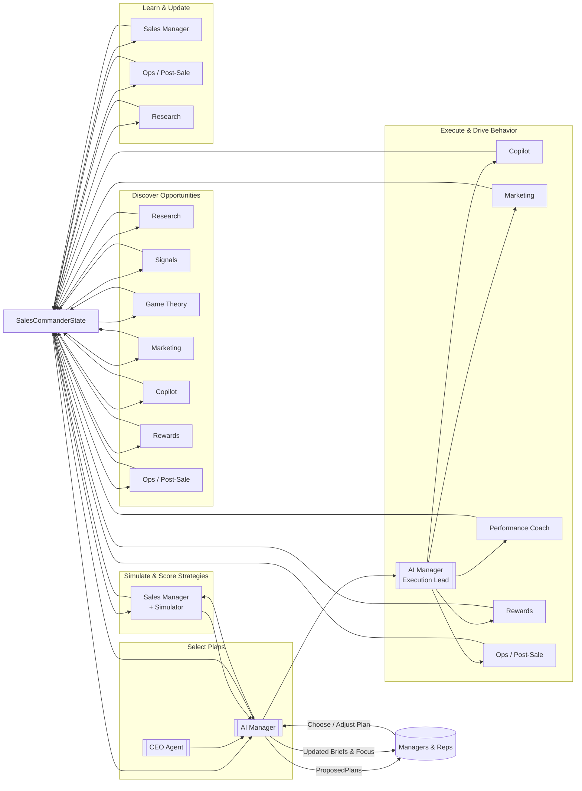

Sales Commander Agentic Team

Mermaid Detail

Here’s the **Discover → Simulate → Select Plan → Execute → Learn** loop as a focused Mermaid graph, plus a compact description.

## Goal Engine loop (Mermaid)

## Stage descriptions

- **Discover**: Research, Signals, Game Theory, Marketing, Copilot, Rewards, and Ops continuously mine data and external sources to populate an **opportunity and strategy pool** in shared state.  
- **Simulate**: Sales Manager’s simulator turns candidate strategies and plays into **StrategyScorecards** (probability of hitting goals, risk, upside) based on historical and current data.  
- **Select Plan**: AI Manager (informed by CEO goals) uses those scorecards + qualitative constraints to propose a few **Plans** for humans to choose from; the human only picks, they don’t design.  
- **Execute**: AI Manager decomposes chosen plans and drives Copilot, Marketing, Performance Coach, Rewards, and Ops to implement them; all actions and signals go back into state.  
- **Learn**: Sales Manager, Ops, and Research read real outcomes, update metrics and priors, and write back improved data; AI Manager uses this to refine future discovery, simulations, and plan choices.

The key is to make **plans and cycles autonomous and goal‑anchored**, with humans only approving or adjusting plans—not prompting agents for ideas or ad‑hoc answers. [nexaitech](https://nexaitech.com/multi-ai-agent-architecutre-patterns-for-scale/)

## 1) Autonomous, goal-driven cycles

- Cycles (Discover → Simulate → Select → Execute → Learn) are triggered by **time and state**, not user prompts: daily scans, weekly plan reviews, monthly strategy refresh tied to GoalSpec and performance thresholds. [docs.cloud.google](https://docs.cloud.google.com/architecture/choose-design-pattern-agentic-ai-system)
- Each cycle starts from **GoalSpec + current results gap**, not “what does the manager feel like asking?,” so the system is always solving “how do we close the gap to target?” rather than answering generic questions. [nexaitech](https://nexaitech.com/multi-ai-agent-architecutre-patterns-for-scale/)

Example: if Q2 is pacing at 78% vs target, AI Manager automatically initiates a “Plan Repair” cycle; humans don’t need to ask for it.

## 2) Plans, not prompts, as the human interface

- AI Manager never exposes raw “ask me anything.” Instead, it shows a **small menu of plans** with probabilities and trade‑offs (from Sales Manager’s simulations) and asks the manager/CEO to **choose or tweak one**, not to invent a plan. [arxiv](https://arxiv.org/html/2601.08839v1)
- Once a plan is chosen, all downstream behavior (Copilot coaching, Marketing campaigns, Performance Coach pushes, Rewards designs) is driven by that plan and its metrics, not by ad‑hoc human prompts.

So the human interaction is: “pick between Plan A/B/C and set your comfort level,” not “what should we do about this deal?”

## 3) Anti-busyness bias: hard constraints in the system

To avoid sliding back into “busy equals good,” we bake in structural constraints:

- **Output metrics over activity metrics**: Sales Manager’s StrategyScorecards optimize for revenue, margin, and leading indicators *with proven correlation*—not just calls/emails. [nexaitech](https://nexaitech.com/multi-ai-agent-architecutre-patterns-for-scale/)
- **Performance Coach** only proposes actions that move validated metrics tied to chosen plans; “make more calls” doesn’t show up unless simulations show it changes outcome odds.  
- AI Manager’s plans are evaluated and re‑ranked by **probability of hitting GoalSpec**, not “number of tasks completed.”

If a team is busy but not progressing, the Learn stage feeds that into simulations and future plans as **evidence that those behaviors don’t work**, so they’re down‑weighted.

## 4) Agents as explorers and critics, not consensus averagers

- Discovery agents (Research, Signals, Game Theory, Marketing, Rewards, Ops) are configured to **seek outliers and asymmetries**, not averages: unusual win patterns, contrarian segments, non‑obvious incentive effects. [trilogyai.substack](https://trilogyai.substack.com/p/multi-agent-deep-research-architecture)
- Each idea goes through a **critic/simulator** path (Sales Manager + internal critics) before it becomes a candidate plan; weak, “busy‑work” ideas die in simulation or fail to improve goal‑probability and never reach humans. [arxiv](https://arxiv.org/html/2601.08839v1)

This keeps the system from converging on the “average of what everyone already does.”

## 5) AI Manager as enforcer of focus

- AI Manager strictly **limits what it surfaces**: for any time window, it may show a manager only a handful of focus areas and actions, not a long backlog.  
- Performance Coach’s `PerformanceInsights` feed AI Manager, but AI Manager filters to 3–5 high‑leverage actions per rep/day that align with the active plan; everything else is invisible noise.

In short: the runtime is always asking “what’s the highest‑leverage next move to close the gap to goal?” rather than “what else can the rep be busy with?”

## 6) Role of humans in this loop

- Humans **set guardrails and choose between simulated plans**, then execute using AI Manager’s instructions.  
- They do *not* design plans from scratch, orchestrate agents via prompts, or reward busyness; those channels simply don’t exist in the app.

